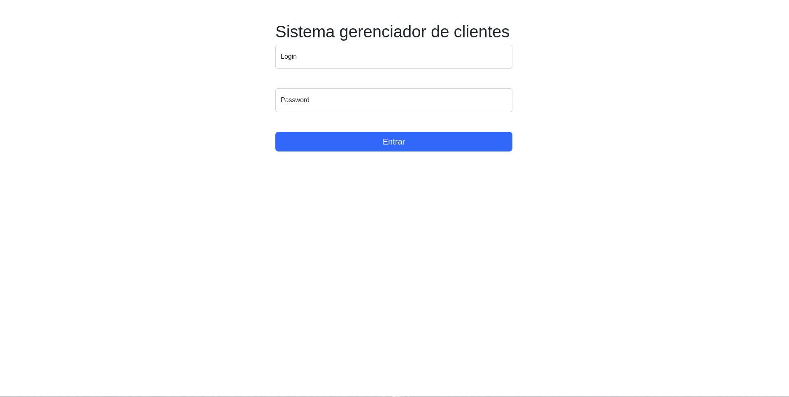
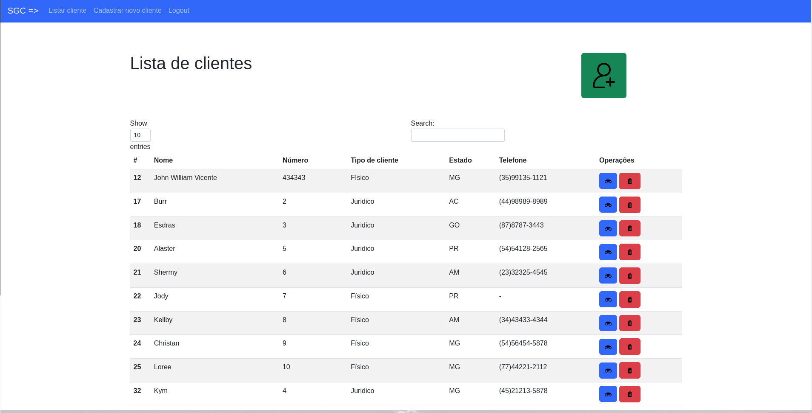
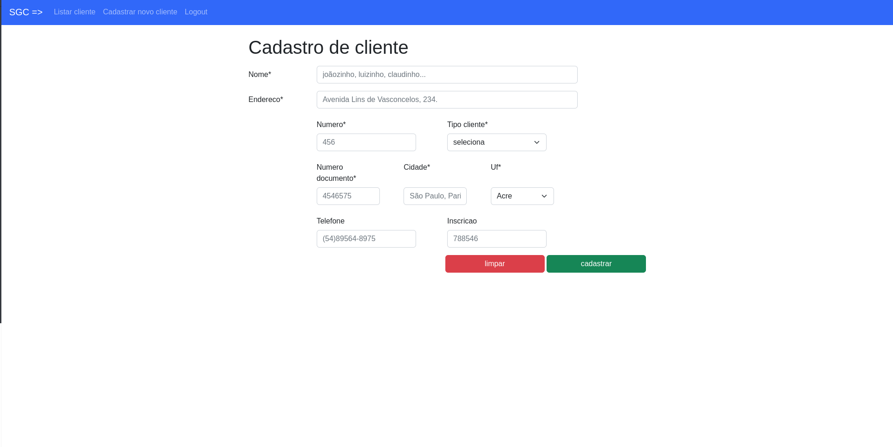

# Projeto CRUD trabalho final

O objetivo do trabalho é desenvolver o front end utilizando HTML, CSS, JavaScript e Jquery e o
back end de um sistema web utilizando PHP e Banco de Dados MYSQL.

# Passo a passo para executar

## Banco
 Dentro da pasta há um arquivo chamado dump.sql. Existe a necessidade de executar esse script sql em
um banco de dados, é necesario que haja um schema chamado "web" e que esse schema estaja em uso ao executar esse script. Isso fara com que a base de dados seja a mesma que os que fizeram esse trabalho projetaram.

## Porta Banco
 Não devera haver senha no banco, e se houver deverar ser trocada no arquivo Conection.php, e mysql deverá rodar na porta 3306.

## Como acessar
A pasta do projeto web deverá ser colocada na pasta htdocs do xampp e ser acessada como é acessado qualquer projeto ali adicionado.

## Senhas e autorização
A senha pro sistema he o seguinte:
 * login: john
 * password: admin

# Imagens

